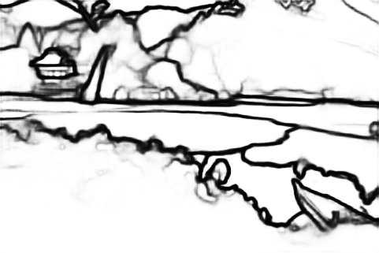

# PEdger
Yuanbin Fu, and Xiaojie Guo. *Practical Edge Detection via Robust Collaborative Learning*.  In ACM Multimedia, 2023

# Introduction
Edge detection, as a core component in a wide range of vision-oriented tasks, is to identify object boundaries and prominent edges in natural images. An edge detector is desired to be both efficient and accurate for practical use. To achieve the goal, two key issues should be concerned: 1) How to liberate deep edge models from inefficient pre-trained backbones that are leveraged by most existing deep learning methods, for saving the computational cost and cutting the model size; and 2) How to mitigate the negative influence from noisy or even wrong labels in training data, which widely exist in edge detection due to the subjectivity and ambiguity of annotators, for the robustness and accuracy. In this paper, we attempt to simultaneously address the above problems via developing a collaborative learning based model, termed PEdger. The principle behind our PEdger is that, the information learned from different training moments and heterogeneous (recurrent and non recurrent in this work) architectures, can be assembled to explore robust knowledge against noisy annotations, even without the help of pre-training on extra data. Extensive ablation studies together with quantitative and qualitative experimental comparisons on the BSDS500 and NYUD datasets are conducted to verify the effectiveness of our design, and demonstrate its superiority over other competitors in terms of accuracy, speed, and model size.

# Preparing Data
Download the augmented BSDS and PASCAL VOC datasets from:

http://mftp.mmcheng.net/liuyun/rcf/data/HED-BSDS.tar.gz

http://mftp.mmcheng.net/liuyun/rcf/data/PASCAL.tar.gz

Download the augmented NYUD dataset from:

http://mftp.mmcheng.net/liuyun/rcf/data/NYUD.tar.gz

# Pretrained Model
``checkpoint.pth” in this repository is our pre-trained model.

# Training
change the data path in ``main.py" to your own path, then run:

`python main.py`

# Testing
change the data path and checkpoint path in ``test.py" to your own path, then run:

`python test.py`

# Evaluation
The matlab code for evaluation can be downloaded in https://www2.eecs.berkeley.edu/Research/Projects/CS/vision/grouping/resources.html. Before evaluation, the non-maximum suppression should be done through running ``edge_nms.m" in https://github.com/yun-liu/RCF.  The codes for plotting Precision-Recall curves are in https://github.com/yun-liu/plot-edge-pr-curves.

# Visual Results

#
